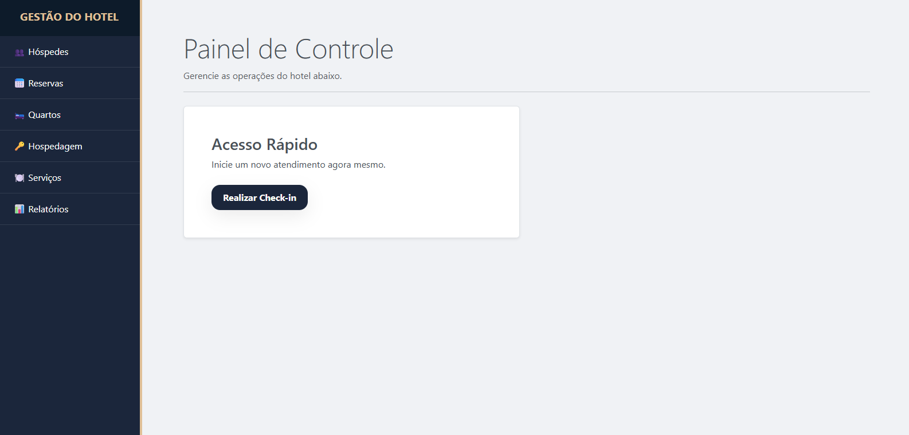
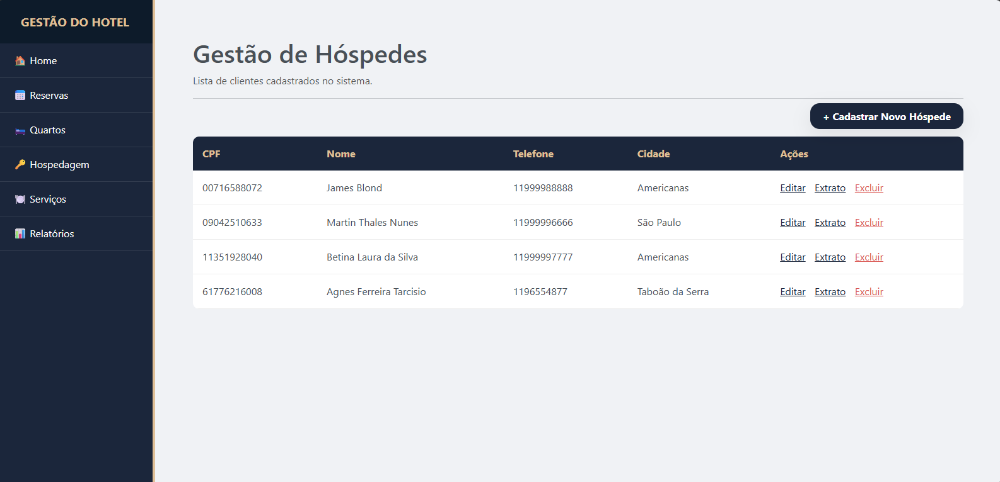
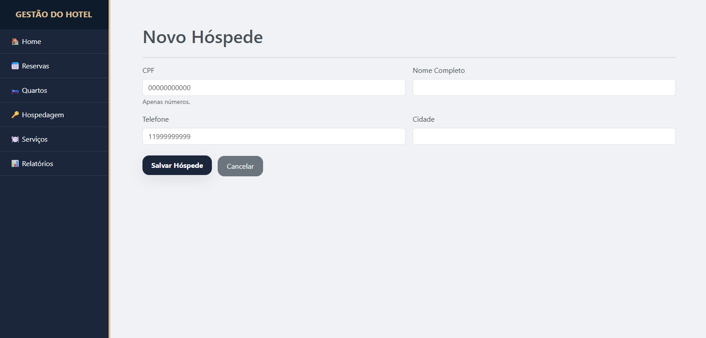
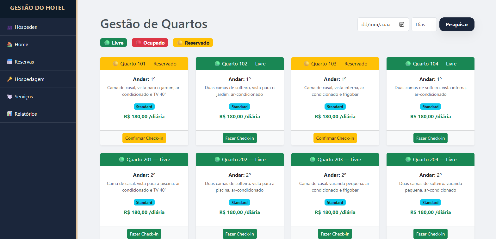
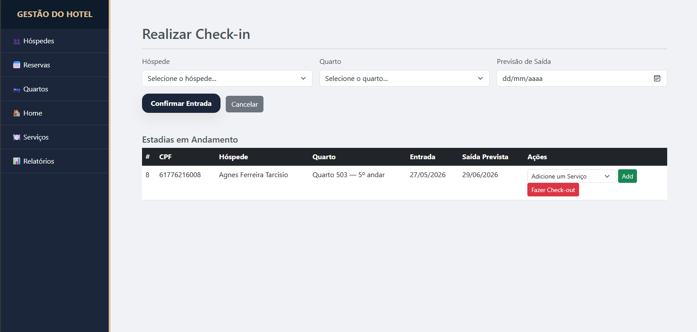
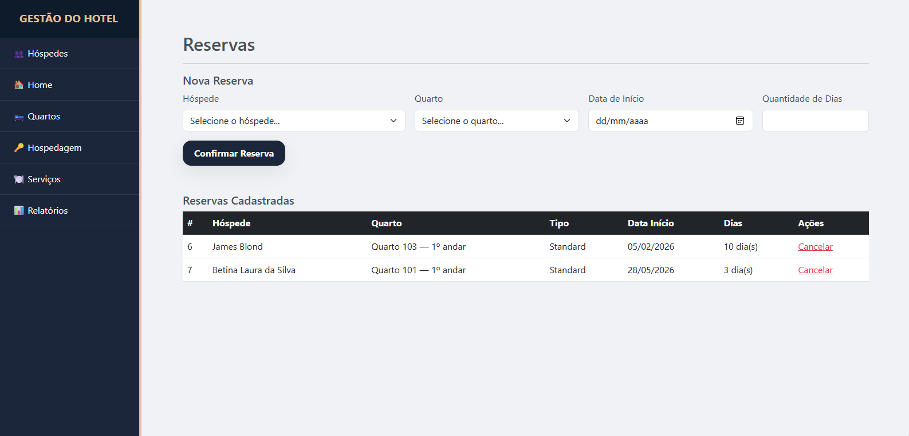
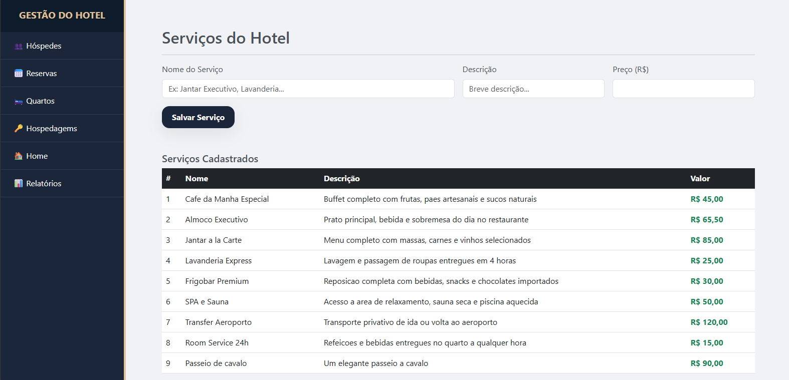
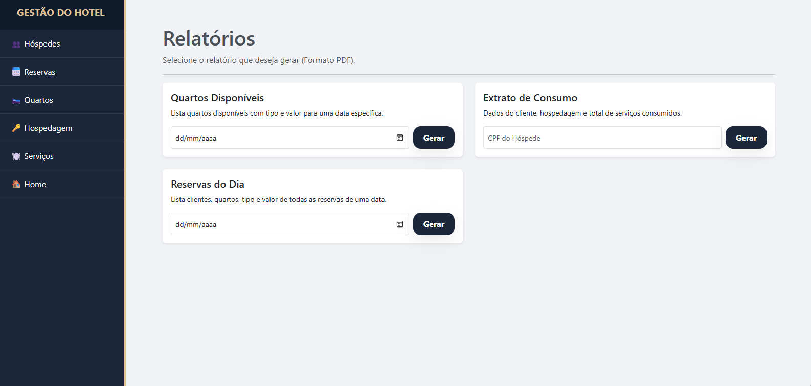

# Sistema de Gestão de Hotel

## OBJETIVO
Este projeto foi desenvolvido como parte de uma avaliação acadêmica, com o objetivo de aplicar conceitos utilizando **Spring Boot**, **Spring Data JPA**, **Spring Web** e banco de dados relacional (**SQL Server**).

É um projeto Java Web criado com o **Maven**, que teve como propósito aprofundar o aprendizado em tecnologias na qual estou me desenvolvendo.

## Princípios SOLID
[cite_start]O código-fonte da aplicação encontra-se documentado e comentado explicitando a aplicação dos princípios arquiteturais avaliados:

* **[S] Responsabilidade Única:** Separei o código para cada parte fazer apenas uma coisa. Os Models só guardam os dados, os Controllers controlam o que aparece na tela e os Repositories conversam direto com o banco de dados.
* **[O] Aberto/Fechado:** Usei as ferramentas do Spring para criar consultas personalizadas no banco de dados sem precisar mexer ou estragar a estrutura que já estava pronta no sistema.
* **[L] Substituição de Liskov:** O próprio Spring organiza as conexões de banco de dados por baixo dos panos, permitindo que o sistema troque as classes internas de persistência automaticamente sem travar o projeto.
* **[I] Segregação de Interfaces:** Criei conexões separadas para o hotel, fazendo com que o código use apenas as funções que realmente precisa..
* **[D] Inversão de Dependência:** Em vez de eu ter que criar e conectar as conexões do banco de dados na mão em cada parte do código, usei o @Autowired para o Spring fazer essa ligação sozinho para mim.

## Modelagem e Arquitetura
Abaixo estão os diagramas que serviram de base para a construção do sistema, elaborados no **Visual Paradigm**:

### Diagrama de Classes

### Diagrama de Entidade e Relacionamento (DER)

## 🖥️ Demonstração da Interface (Prints das Telas do Sistema)
Evidências da usabilidade (UX), estilização com Bootstrap/CSS e barramentos de validação desenvolvidos na camada View.

### Tela Principal

### Listagem e Gestão de Clientes

> **Observação:** Todos os CPFs e dados exibidos na tela de clientes são totalmente fictícios e foram gerados através da plataforma 4Devs exclusivamente para fins de testes do sistema.

### Formulário de Cadastro e Edição de Clientes

### Consulta de Quartos Ocupados/Disponíveis

### Gerenciamento de Hospedagens Ativas

### Controle de Reservas

### Catálogo de Serviços

### Painel de Emissão de Relatórios Gerenciais com JasperReports 7.0.3
Módulo especialista para geração de PDFs blindados contra dados nulos e interceptação de fluxos vazios.

## Tecnologias Utilizadas 
- **Java** (Linguagem principal)
- **Spring Boot** (Framework)
- **Spring Data JPA** (Persistência)
- **Spring Web** (Interface Web)
- **Maven** (Gerenciamento de dependências e build)
- **Bootstrap / CSS** (Estilização e interface)
- **JasperReports 7.0.3**(Geração de relatórios)
- **SQL Server** (Banco de dados relacional)
- **Eclipse IDE** (Ambiente de desenvolvimento)
- **Visual Paradigm** (Modelagem de diagramas)
- **Git e GitHub** (Versionamento)

## Referências
- Documentação do Spring Boot
- Documentação do CSS3
- CSS Layout : [MDN Web Docs](https://developer.mozilla.org/pt-BR/)
- Estilização e componentes: [Bootstrap](https://bootstrap.com/)
- Geração de Pessoas: [4Devs](https://www.4devs.com.br/gerador_de_pessoas)
- Consultas SQL e Procedures e UDFs: Baseadas nas aulas de Laboratório de Banco de Dados e Banco de Dados - Fatec ZL.
---
**Desenvolvido por Daiane Tararam**  
*Estudante de Análise e Desenvolvimento de Sitemas na Fatec ZL*
